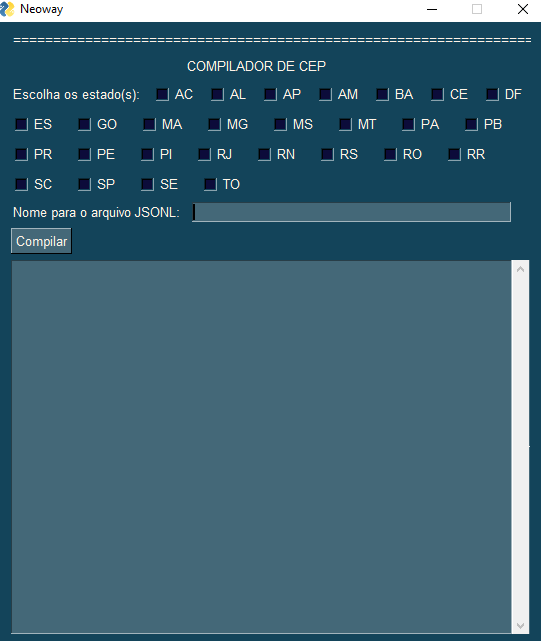
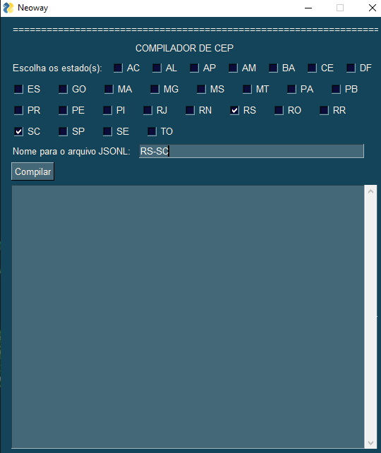
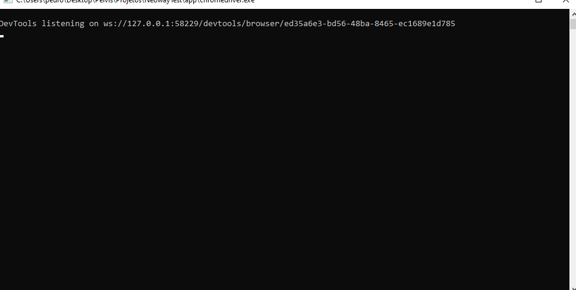
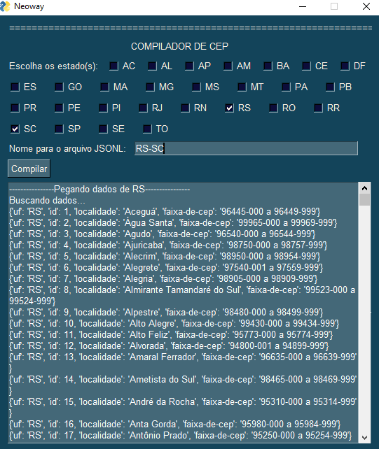
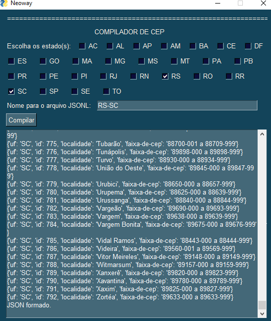
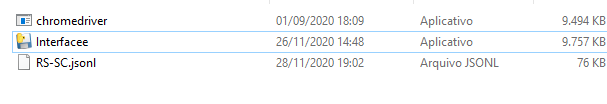

# Data Pirates
##  About the challenge
 This challenge was made by Neoway. The challenge was collecting data from correios website (http://www.buscacep.correios.com.br/sistemas/buscacep/buscaFaixaCep.cfm) about at least 2 UF's and write the results in a JSONL file, using python. For this challenge i made two way to do that, a app with interface to select which UF's you want to get or using a IDLE.
 ## How to use the app
  1. First you need to download the folder nameb by "app"
  2. Open 'Interfacee' than will open this
  

  3. Chose the UF's you want to get data
  

  4. Will apper this, but only ignore
  

  5. Now the dates are being collected
  

  6. When appear "JSON formado." mean that the file was created and you can see in app folder
  

